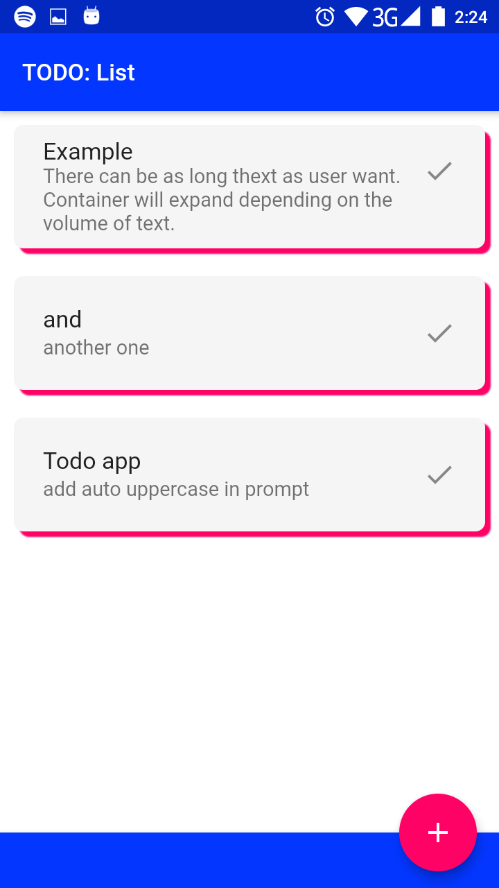
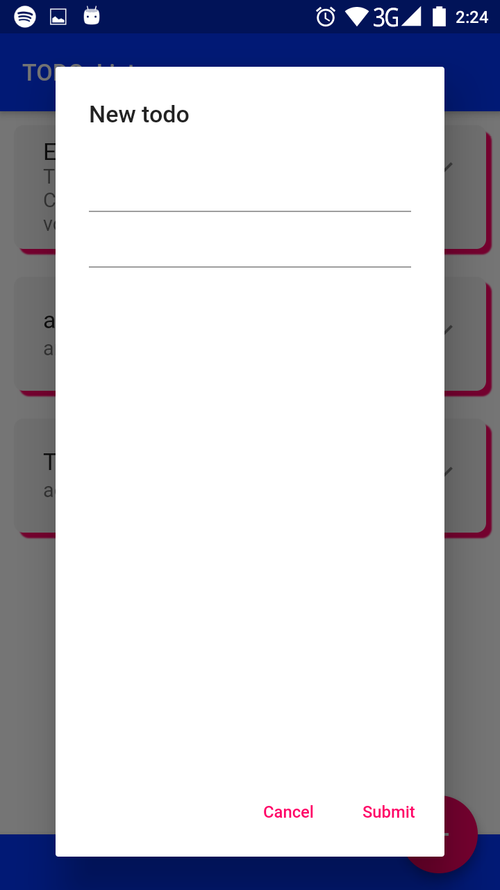
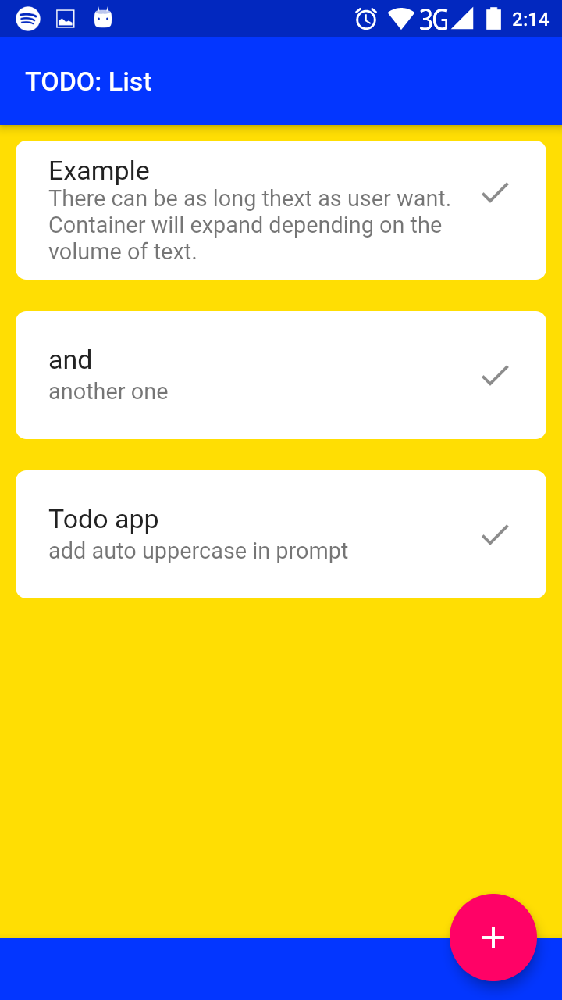
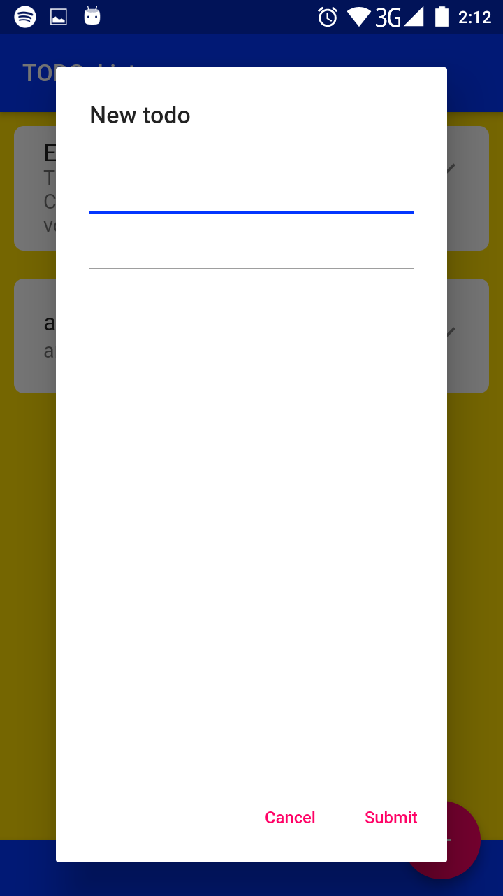

# TODO: list

This application be a 

## Description

This application is an implementation of a simple task list.

## What is already done:
- List representation
- Theme
- Dock with button
- Function to add a new task
- Input form
- Circled borders and back shadow of task items
- 'Done' button for on task item
   
## What is going to be done:
- Function to delete finished task: User tap on garbage button then select items to delete
- Delete all button
- Correct item button
- Autoscroll to the last sign
## Screenshoots
### Priority theme

### Secondary theme

Resources: 
- [Cookbook: Useful Flutter samples](https://flutter.dev/docs/cookbook)
- [online documentation](https://flutter.dev/docs)